# Analyse et Sécurisation du Réseau a l'aide de Wireshark

## Introduction

Dans un monde où la cybercriminalité et les menaces informatiques évoluent constamment, assurer la sécurité d'un réseau informatique est devenu une priorité cruciale pour les organisations de toutes tailles. Les réseaux modernes, souvent vastes et complexes, sont des cibles fréquentes pour diverses formes d'attaques, telles que les intrusions non autorisées, les attaques par déni de service (DoS) et les tentatives de vol de données. Dans ce contexte, la capacité à détecter et à répondre rapidement aux activités suspectes devient un impératif stratégique.

Ce projet, intitulé "Analyse et Sécurisation du Réseau à l'aide de Wireshark", vise à répondre à ces défis en utilisant Wireshark, un outil de capture et d'analyse de paquets de réseau de renommée mondiale. Wireshark est reconnu pour sa puissance et sa flexibilité, permettant aux professionnels de la sécurité informatique de surveiller, d'analyser et de diagnostiquer les problèmes de réseau de manière détaillée. 

## Préparation de l'Environnement

#### Wireshark

Wireshark est un outil de capture et d'analyse de paquets réseau largement utilisé dans les tests de sécurité et l'analyse de réseaux. Pour ce projet, Wireshark est installé par défaut sur les distributions Kali Linux, qui est un système d'exploitation dédié aux tests de sécurité. Kali Linux fournit une suite complète d'outils pour l'analyse et le test de la sécurité réseau, ce qui facilite l'intégration de Wireshark dans l'environnement de test.

#### Préparation du Réseau de Test

Pour assurer une analyse efficace et sécurisée, un environnement de test isolé a été utilisé en employant VMware Workstation. Le réseau de test a été configuré en mode "Host-Only" pour créer un réseau privé virtuel. Cette configuration permet aux machines virtuelles de communiquer uniquement entre elles et avec l'hôte, tout en restant isolées du réseau externe. Les machines virtuelles utilisées dans ce projet sont :

- **Kali Linux** : Fournit les outils nécessaires pour les tests de sécurité et l'analyse réseau.
- **Metasploitable 2** : Une machine virtuelle vulnérable utilisée pour tester les techniques d'exploitation et les outils de sécurité.
- **Windows XP** : Un système d'exploitation plus ancien souvent ciblé dans des scénarios de tests de sécurité pour évaluer les vulnérabilités et les exploits.
- **Ubuntu 22.04** : Un système d'exploitation moderne utilisé pour simuler un environnement de serveur ou de client dans les tests de réseau.

Les étapes de préparation incluent :

1. **Configuration de VMware Workstation :**
   - **Création d'un réseau virtuel "Host-Only" :** VMware a été configuré pour utiliser un réseau "Host-Only", permettant aux machines virtuelles de communiquer entre elles


   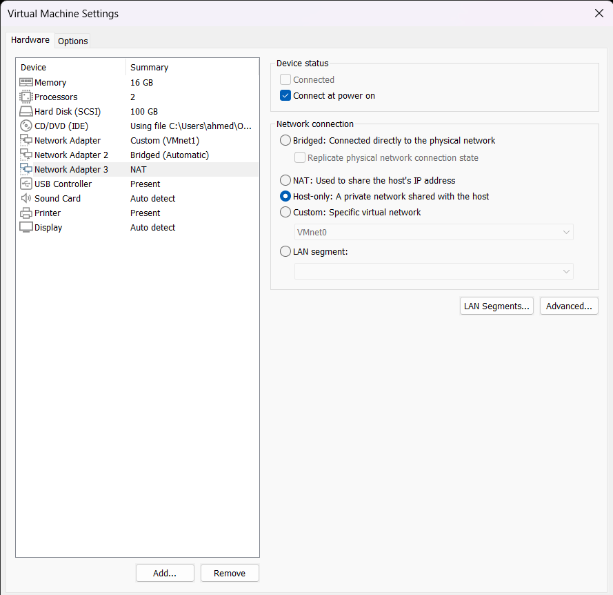


   - **Ajout des machines virtuelles :** Les machines virtuelles Kali Linux, Metasploitable 2, Windows XP et Ubuntu 22.04 ont été créées et configurées sur ce réseau "Host-Only". Chaque machine virtuelle a été configurée avec une adresse IP  attribuée par le serveur DHCP du réseau "Host-Only".

1. **Vérification de la Connectivité :**

 - **Test de la communication entre les machines :** l'outil `ping` a été utiliséss pour vérifier que les machines virtuelles pouvaient communiquer entre elles .


    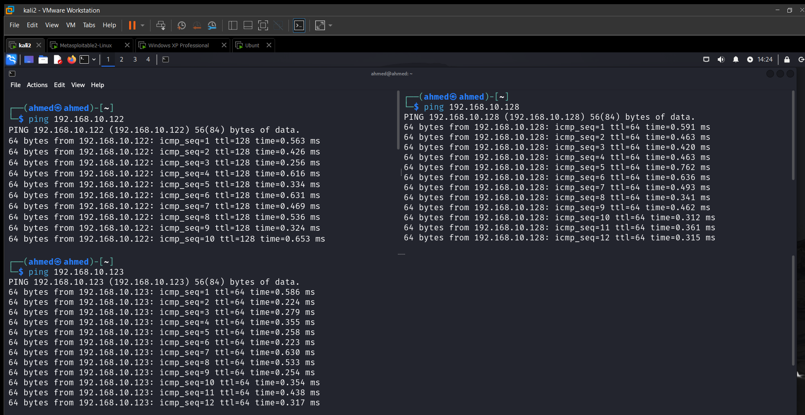


## Démarrage de la Capture avec Wireshark

Après avoir préparé l'environnement de test, il est crucial de configurer correctement Wireshark pour capturer les données pertinentes.
Lors du démarrage de wireshark, l'interface réseau correspondant au réseau "Host-Only" a été sélectionnée pour garantir que le trafic capturé provient du réseau de test isolé.

 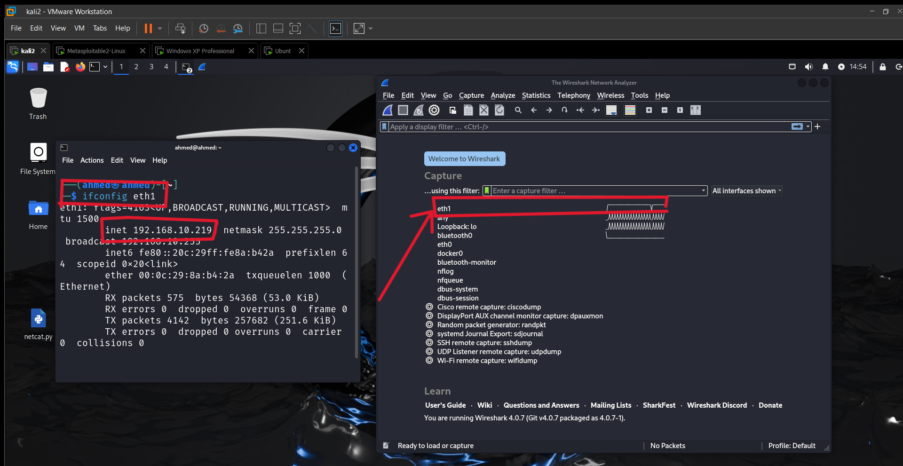

## Configurations des Filtres

Lors de la première exécution de Wireshark, une grande quantité de trafic est observée, comprenant principalement des paquets de diffusion (broadcast) et des protocoles de gestion de réseau tels que ARP, CDP, LLDP et STP.
 
 
 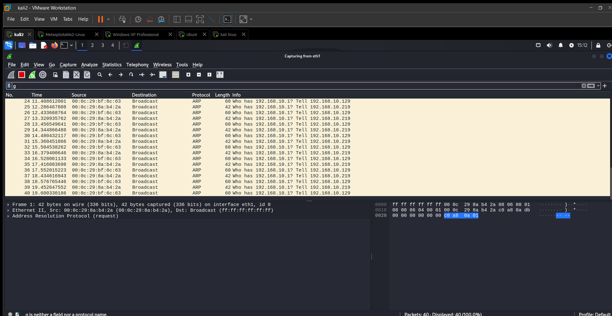

 
Pour se concentrer sur le trafic pertinent et réduire la surcharge d'informations, un filtre a été appliqué :
  !(eth.dst == ff:ff:ff:ff:ff:ff || arp || cdp || lldp || stp )

  
   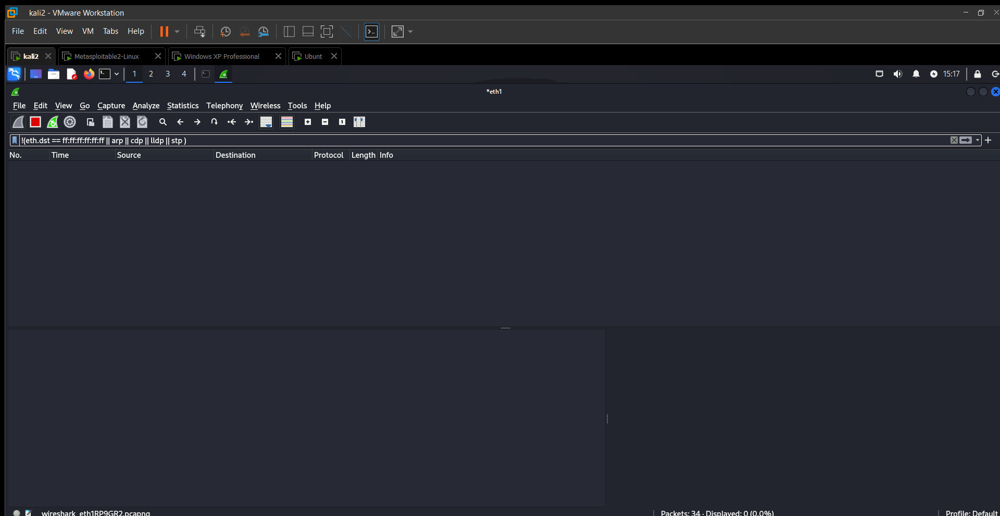

   
   Ce filtre exclut les paquets de diffusion et les protocoles de gestion réseau, permettant ainsi de se focaliser sur le trafic plus significatif pour l'analyse. 

   ### Filtrage par port :


Pour analyser spécifiquement le trafic ICMP, tel que les requêtes et les réponses de ping, les étapes suivantes ont été suivies :

1. **Effectuer le Ping :**
   - Depuis la machine Kali, un terminal a été ouvert.
   - La commande de ping suivante a été exécutée pour envoyer des paquets ICMP Echo Request à la machine Metasploitable :

     ```bash
     ping 192.168.10.123
     ```

2. **Capturer et Analyser le Trafic :**
   - Wireshark a été lancé et l'interface réseau appropriée pour la capture a été sélectionnée.
   - Le filtre `icmp` a été entré dans la barre de filtre de Wireshark pour afficher uniquement les paquets ICMP :

     ```plaintext
     icmp
     ```

  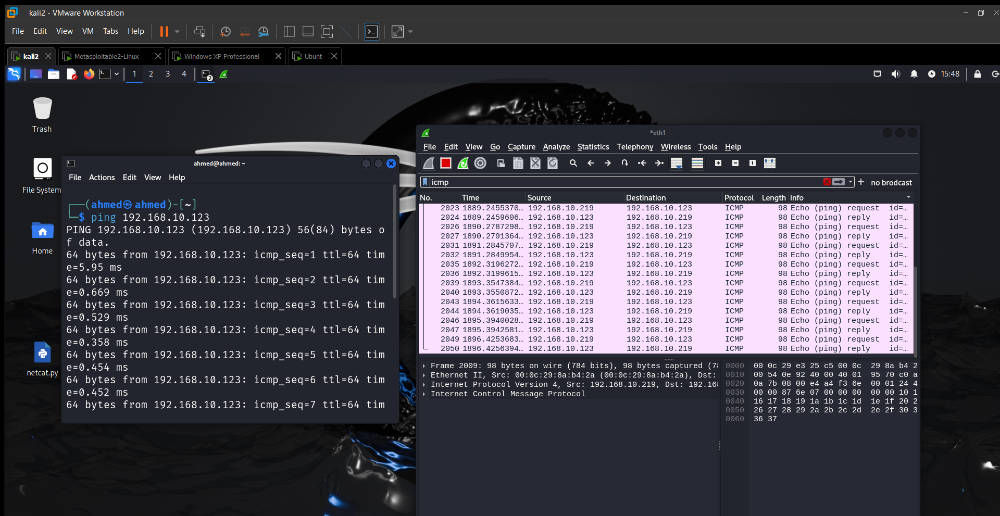
     

   - La capture a été démarrée. Les paquets ICMP Echo Request envoyés par Kali et les réponses ICMP Echo Reply de Metasploitable ont été visibles.


### Filtrage par Adresses IP : 

Pour se concentrer sur des adresses IP spécifiques dans le réseau, un filtre plus ciblé a été utilisé. Ce filtre permet de restreindre la capture aux paquets envoyés d'une adresse IP source à une adresse IP de destination particulière. Par exemple, pour observer le trafic entre l'adresse IP 192.168.10.219 et l'adresse IP 192.168.10.123, le filtre suivant a été appliqué :

 ```bash
     ip.src == 192.168.10.219 && ip.dst == 192.168.10.123
 ```

  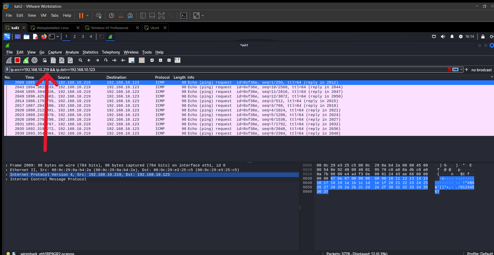

Ce filtre a permis de se concentrer uniquement sur le trafic entre ces deux adresses IP, facilitant ainsi l'analyse des communications spécifiques entre ces machines et éliminant les autres paquets qui ne sont pas pertinents pour cette analyse.

Pour vérifier ce filtre , un test de ping a été effectué depuis la machine Ubuntu, avec l'adresse IP 192.168.10.128, vers la machine Windows, avec l'adresse IP 192.168.10.122. 

 
 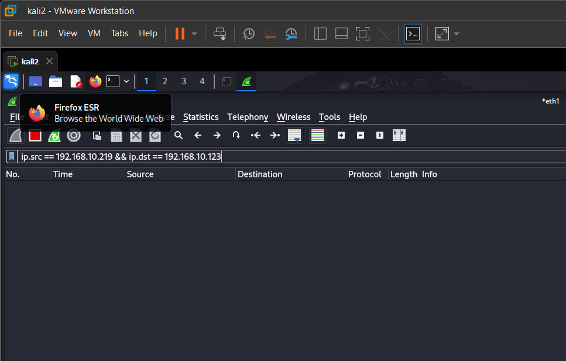

 
**Observation :** Wireshark n'a pas capturé les paquets de ce ping. Cela est dû à l'utilisation du filtre qui spécifiait uniquement les paquets entre deux adresses IP spécifiques. En effet, le filtre appliqué limitait la capture aux paquets entre les adresses IP 192.168.10.219 et 192.168.10.123. Par conséquent, les pings effectués entre les adresses IP 192.168.10.128 et 192.168.10.122 ont été exclus de la capture. 

## SYN Scan et Scan de Handshake Complet

Avant d'appliquer le filtre `tcp.flags.syn==1`, il est important de comprendre les différentes méthodes de scan utilisées pour détecter les ports ouverts sur un réseau. Deux méthodes couramment employées sont le **SYN Scan** et le **scan de handshake complet**.

### SYN Scan

Le **SYN Scan** est une technique de scan de ports qui permet d'identifier les ports ouverts sur une machine cible sans établir une connexion TCP complète. Voici un aperçu de cette méthode :

 **Fonctionnement :**
   - Lors d'un SYN Scan, l'outil de scan envoie des paquets TCP avec le drapeau SYN activé à différents ports sur la machine cible.
   - Si un port est ouvert, le serveur répondra avec un paquet SYN-ACK, indiquant qu'il est prêt à établir une connexion.
   - Si le port est fermé, le serveur répondra avec un paquet RST, signalant que la connexion est refusée.
   - Les ports filtrés peuvent ne pas répondre ou répondre avec un paquet ICMP d'erreur.

 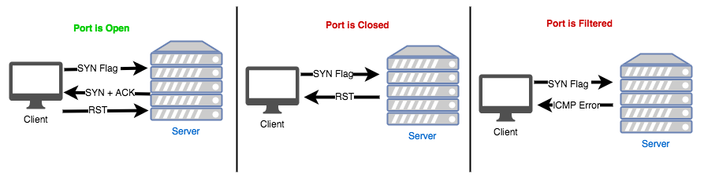

 
Le SYN Scan est souvent moins détectable car il ne complète pas la connexion TCP. Cela le rend moins visible pour les systèmes de détection d'intrusion.
-Il est généralement plus rapide que les scans complets puisqu'il n'implique pas la finalisation du processus de connexion.

### Scan de Handshake Complet

En revanche, le **scan de handshake complet** (ou **scan TCP connect()**) établit une connexion TCP complète avec la machine cible. Voici comment il fonctionne :

 
   - Le scan débute par l'envoi d'un paquet SYN. Si le port est ouvert, le serveur répondra avec un SYN-ACK, et l'outil de scan enverra un paquet ACK pour compléter le handshake TCP. La connexion est ensuite fermée avec un paquet FIN.
   - Si le port est fermé, le serveur enverra un paquet RST en réponse.
.
    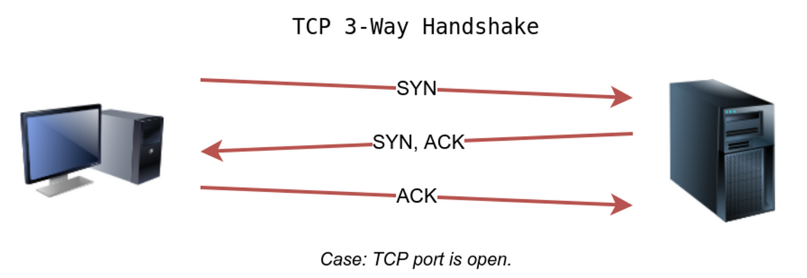


   - **Détection :** Le scan de handshake complet établir une connexion complète est plus facile à détecter, ce qui peut rendre le scan plus visible aux systèmes de sécurité.

     ## Capture SYN Scan

Pour capturer et analyser les résultats d'un scan de ports, la commande suivante a été utilisée sur Kali Linux (machine de l'attaquant) pour scanner la machine Metasploitable (machine de vectime) :


 ```bash
     nmap -sS -T4 192.168.10.123
 ```

  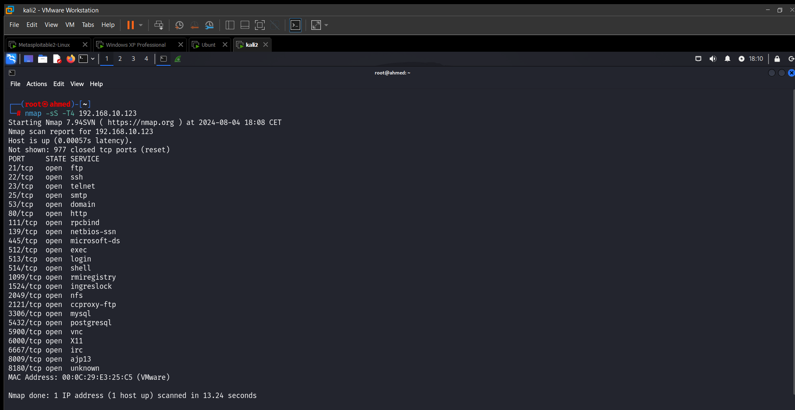


-sS : Effectue un syn scan .

-T4 : Augmente la vitesse du scan pour obtenir les résultats plus rapidement.

Après avoir effectué le scan avec nmap, un filtre a été appliqué dans Wireshark pour isoler les paquets SYN :

 ```bash
     tcp.flags.syn==1
 ```

  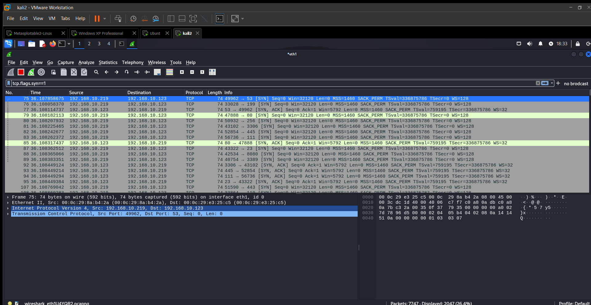


  Lors de l'analyse du trafic réseau capturé pendant un scan de ports, il est important de bien identifier les rôles des machines impliquées : la machine attaquant (qui effectue le scan) et la machine cible (qui reçoit le scan). Voici comment ces rôles sont définis et comment les noms des machines sont modifiés dans Wireshark :

### Définition des Adresses IP

- **Adresse IP de la Machine de l'attaquant :** La machine qui effectue le scan SYN. Dans ce cas, l'adresse IP de la machine attaquante est `192.168.10.219`.
- **Adresse IP de la Machine Cible :** La machine qui est scannée. Dans ce cas, l'adresse IP de la machine cible est `192.168.10.123`.

### Modification des Noms dans Wireshark

Pour faciliter l'analyse dans Wireshark, les noms des machines ont été modifiés comme suit :

1. **Modification du Nom de l'Attaquant**
   - Clic droit sur le premier paquet capturé dans Wireshark.
   - Sélectionner **"Edit Resolved Name"**.
   - Modifier le nom pour refléter l'adresse IP de l'attaquant. Dans ce cas, le nom est changé en **"attacker (192.168.10.219)"**.


2. **Modification du Nom de la Cible**
   - Clic droit sur le premier paquet capturé dans Wireshark.
   - Sélectionner **"Edit Resolved Name"**.
   - Modifier le nom pour refléter l'adresse IP de la cible. Dans ce cas, le nom est changé en **"vectim (192.168.10.123)"**.


      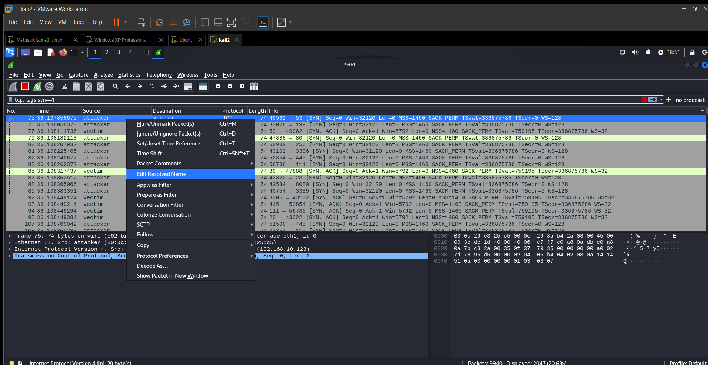

     
    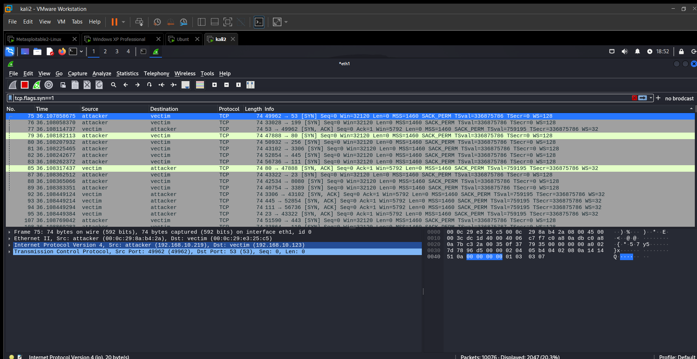

## Analyse des Ports Ouverts dans wireshark

Pour  analyser spécifiquement les réponses SYN-ACK de la machine cible, un filtre a été appliqué pour isoler ces paquets. Voici les étapes détaillées :
   
### Filtrage des Réponses SYN-ACK

Pour capturer uniquement les réponses SYN-ACK de la machine cible (adresse IP 192.168.10.123), le filtre suivant a été utilisé dans Wireshark :

 ```bash
     tcp.flags.syn==1 and ip.src==192.168.10.123

 ```


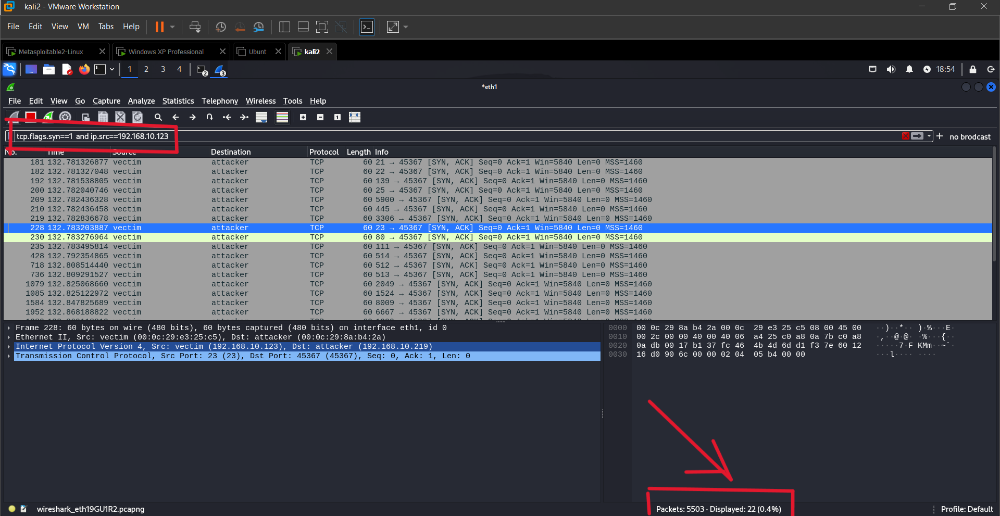


Ce filtre permet d'afficher uniquement les paquets SYN-ACK envoyés par la machine cible, indiquant les ports ouverts en réponse aux requêtes SYN de la machine de l'attaquant.


### Analyse des Ports Ouverts

Après avoir appliqué le filtre et capturé les paquets SYN-ACK, il est possible de vérifier les ports ouverts de la machine cible. Dans cet exemple, 22 paquets sont affichés, indiquant que 22 ports sont ouverts.

Pour assurer et visualiser les résultats, les étapes suivantes ont été suivies :

   - Cliquer sur "Statistiques" dans la barre de menu de Wireshark.
   - Sélectionner "Conversations..." pour ouvrir la fenêtre des conversations réseau.
   - Dans la fenêtre des conversations, cliquer sur l'onglet "TCP".


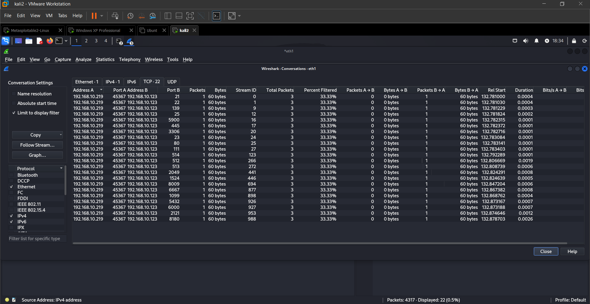


### Résultat des Ports Ouverts

La fenêtre des conversations TCP affiche toutes les connexions TCP identifiées, y compris les ports ouverts sur la machine cible. Les ports ouverts détectés sont listés, confirmant les résultats du filtre précédent.


## Analyse du Port Spécifique :

Lorsqu'un hacker spécifie un port particulier à attaquer, tel que le port 21, il est crucial d'analyser le trafic associé pour comprendre l'état du port et la réponse du système cible. Dans ce cas, un scan a été effectué sur le port 21 de la machine cible à l'aide de Nmap depuis Kali Linux. 

Le port a été identifié comme ouvert.


Pour analyser ce scan dans Wireshark, le filtre suivant a été utilisé pour capturer les paquets liés à ce port :

 ```bash
     tcp.port==21

 ```

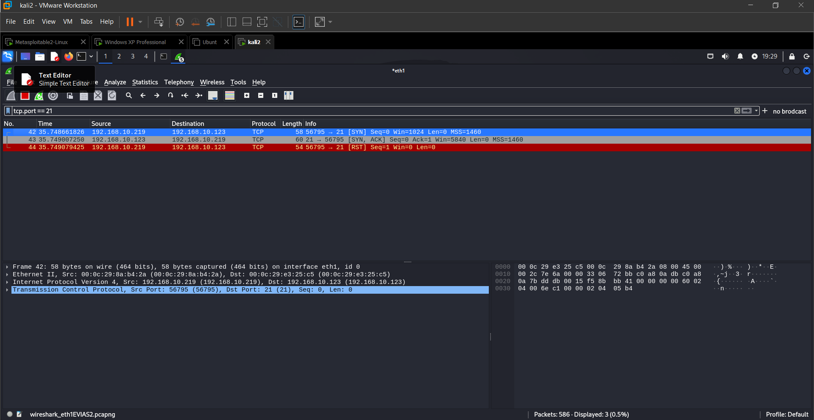

Wireshark affiche les paquets suivants :

 - Paquet SYN : Envoyé de l'attaquant vers la machine cible (victime), indiquant une tentative de connexion sur le port 21.
 - Paquet SYN-ACK : Réponse de la machine cible à l'attaquant, confirmant que le port 21 est ouvert et prêt à établir une connexion.
 - Paquet RST : Envoyé par l'attaquant à la machine cible pour réinitialiser la connexion, ce qui est une indication que l'attaquant a terminé l'analyse et ne souhaite pas poursuivre la connexion.

Ces trois paquets montrent que le port 21 est ouvert sur la machine cible

## Capture du FTP 

Le hacker décide de se connecter au serveur FTP de la machine cible. Pour ce faire, depuis Kali Linux, la commande suivante est exécutée dans le terminal :

 ```bash
     ftp 192.168.10.123

 ```

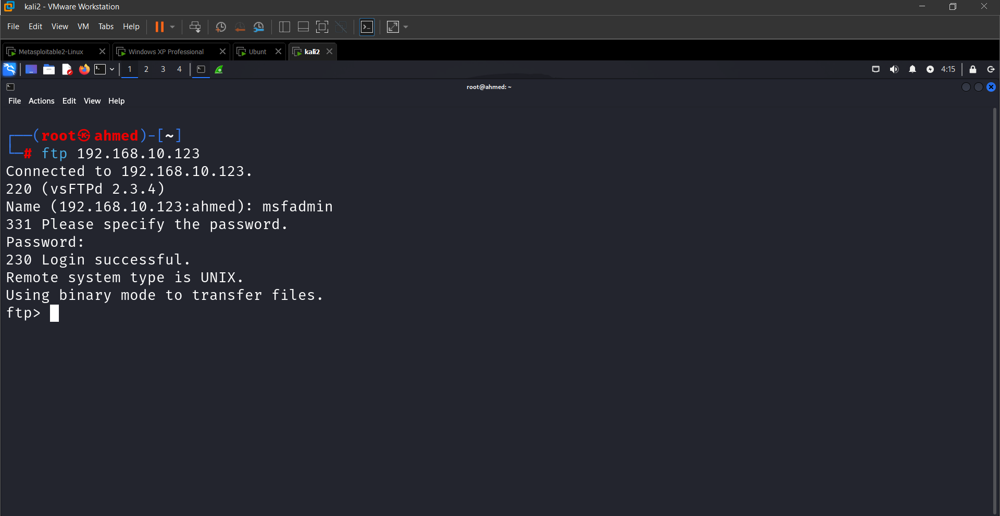

Lors de cette connexion, l'attaquant entre le nom d'utilisateur et le mot de passe pour accéder au serveur. La connexion est réussie et Wireshark capture l'intégralité de ce processus.

Wireshark capture les échanges entre l'attaquant et le serveur FTP. 

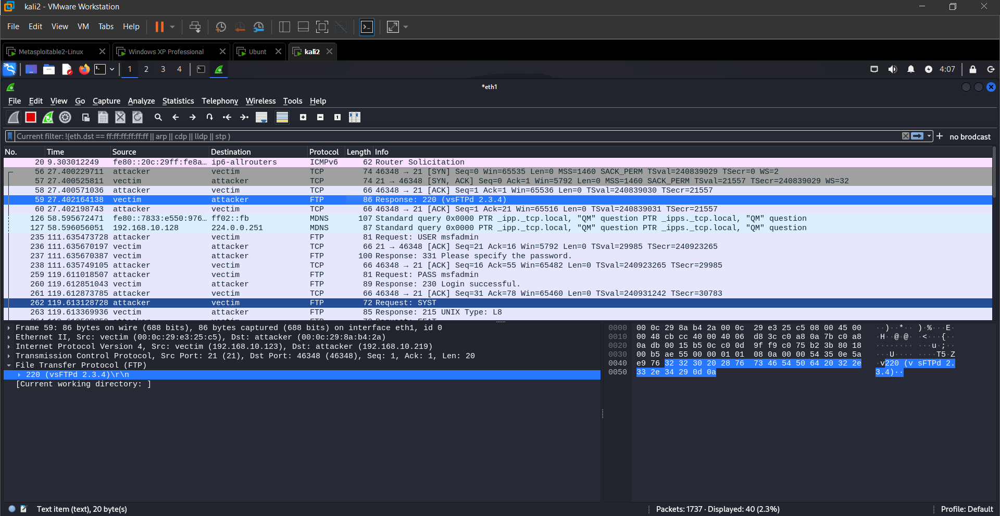

Parmi les informations capturées par wireshark :

   - Version du serveur FTP 
   - Nom d'utilisateur (USER) et mot de passe (PASS) 

Pour afficher tous les noms d'utilisateur et mots de passe entrés par l'attaquant pour accéder au serveur FTP, le filtre suivant est utilisé dans Wireshark :

 ```bash
     ftp contains "PASS" || ftp contains "USER"

 ```

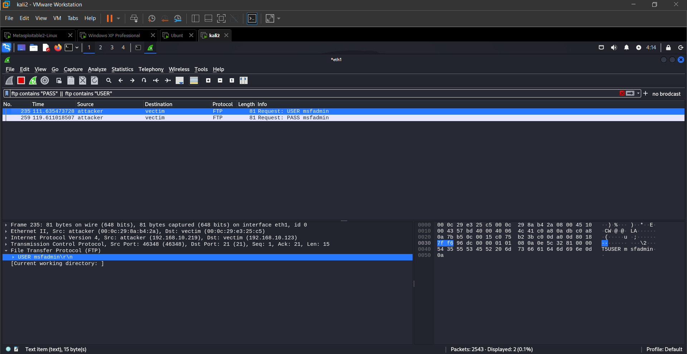


Ce filtre permet de visualiser spécifiquement les paquets contenant les chaînes FTP "USER" et "PASS", révélant ainsi les identifiants utilisés par l'attaquant.


## Connaître le Système d'Exploitation Cible 

La capacité de déterminer le système d'exploitation de la machine cible peut être essentielle pour une analyse approfondie de la sécurité.

Wireshark permet de réaliser cette identification par empreinte passive (passive fingerprinting) en examinant des valeurs spécifiques dans les en-têtes de paquets réseau. Voici comment certaines valeurs courantes des en-têtes peuvent indiquer différents systèmes d'exploitation :

   - Initial Time to Live (TTL) : 64 pour Nmap, BSD, Mac OS et Linux /// 128 pour Novell et Windows /// 255 pour Cisco IOS, Palm OS et Solaris.
   - Don’t Fragment Flag : Set pour BSD, Mac OS X, Linux, Novell, Windows, Palm OS et Solaris /// Not set pour Nmap et Cisco IOS.
   - Max Segment Size (MSS) : 0 pour Nmap /// 1440 pour Windows et Novell /// 1460 pour BSD, Mac OS X, Linux et Solaris.
   - Window Size : 1024–4096 pour Nmap /// 65535 pour BSD et Mac OS X /// 2920–5840 pour Linux /// 16384 pour Novell /// 4128 pour Cisco IOS /// 24820 pour Solaris /// Variable pour Windows.
   - SackOK : Set pour Linux ,Windows et OpenBSD /// Not set pour Nmap, FreeBSD, Mac OS X, Novell, Cisco IOS et Solaris.

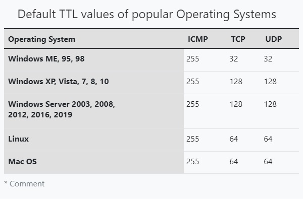

| **Champ d'en-tête**         | **Valeur**      | **Système d'exploitation**                       |
|-----------------------------|-----------------|-------------------------------------------------|
| **Initial Time to Live (TTL)** | 64              | Nmap, BSD, Mac OS X, Linux                       |
|                             | 128             | Novell, Windows                                  |
|                             | 255             | Cisco IOS, Palm OS, Solaris                      |
| **Don’t Fragment Flag**     | Set             | BSD, Mac OS X, Linux, Novell, Windows, Palm OS, Solaris |
|                             | Not set         | Nmap, Cisco IOS                                  |
| **Max Segment Size (MSS)**  | 0               | Nmap                                             |
|                             | 1440            | Windows, Novell                                  |
|                             | 1460            | BSD, Mac OS X, Linux, Solaris                    |
| **Window Size**             | 1024–4096       | Nmap                                             |
|                              65535           | BSD, Mac OS X                                    |
|                              2920–5840       | Linux                                            |
|                              16384           | Novell                                           |
|                              4128            | Cisco IOS                                        |
|                              24820           | Solaris                                          |
|                              Variable        | Windows                                          |
| **SackOK**                  | Set             | Linux, Windows, OpenBSD                          |
