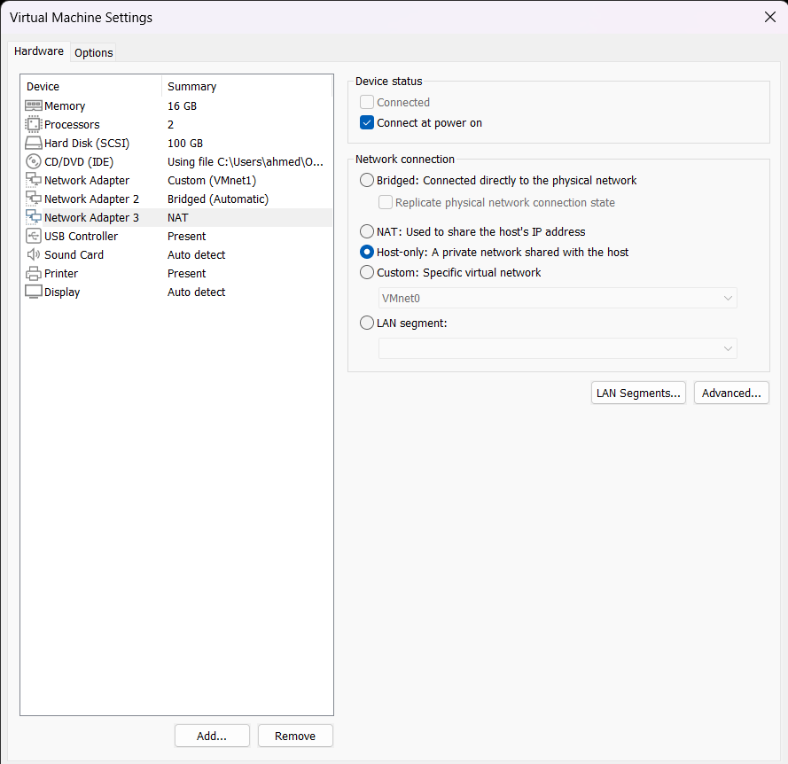

# Analyse et Sécurisation du Réseau a l'aide de Wireshark

## Introduction

Dans un monde où la cybercriminalité et les menaces informatiques évoluent constamment, assurer la sécurité d'un réseau informatique est devenu une priorité cruciale pour les organisations de toutes tailles. Les réseaux modernes, souvent vastes et complexes, sont des cibles fréquentes pour diverses formes d'attaques, telles que les intrusions non autorisées, les attaques par déni de service (DoS) et les tentatives de vol de données. Dans ce contexte, la capacité à détecter et à répondre rapidement aux activités suspectes devient un impératif stratégique.

Ce projet, intitulé "Analyse et Sécurisation du Réseau à l'aide de Wireshark", vise à répondre à ces défis en utilisant Wireshark, un outil de capture et d'analyse de paquets de réseau de renommée mondiale. Wireshark est reconnu pour sa puissance et sa flexibilité, permettant aux professionnels de la sécurité informatique de surveiller, d'analyser et de diagnostiquer les problèmes de réseau de manière détaillée. 

### Préparation de l'Environnement

#### Wireshark

Wireshark est un outil de capture et d'analyse de paquets réseau largement utilisé dans les tests de sécurité et l'analyse de réseaux. Pour ce projet, Wireshark est installé par défaut sur les distributions Kali Linux, qui est un système d'exploitation dédié aux tests de sécurité. Kali Linux fournit une suite complète d'outils pour l'analyse et le test de la sécurité réseau, ce qui facilite l'intégration de Wireshark dans l'environnement de test.

#### Préparation du Réseau de Test

Pour assurer une analyse efficace et sécurisée, un environnement de test isolé a été utilisé en employant VMware Workstation. Le réseau de test a été configuré en mode "Host-Only" pour créer un réseau privé virtuel. Cette configuration permet aux machines virtuelles de communiquer uniquement entre elles et avec l'hôte, tout en restant isolées du réseau externe. Les machines virtuelles utilisées dans ce projet sont :

- **Kali Linux** : Fournit les outils nécessaires pour les tests de sécurité et l'analyse réseau.
- **Metasploitable 2** : Une machine virtuelle vulnérable utilisée pour tester les techniques d'exploitation et les outils de sécurité.
- **Windows XP** : Un système d'exploitation plus ancien souvent ciblé dans des scénarios de tests de sécurité pour évaluer les vulnérabilités et les exploits.
- **Ubuntu 22.04** : Un système d'exploitation moderne utilisé pour simuler un environnement de serveur ou de client dans les tests de réseau.

Les étapes de préparation incluent :

1. **Configuration de VMware Workstation :**
   - **Création d'un réseau virtuel "Host-Only" :** VMware a été configuré pour utiliser un réseau "Host-Only", permettant aux machines virtuelles de communiquer entre elles
   

   - **Ajout des machines virtuelles :** Les machines virtuelles Kali Linux, Metasploitable 1, Windows XP et Ubuntu 22.04 ont été créées et configurées sur ce réseau "Host-Only". Chaque machine virtuelle a été configurée avec une adresse IP statique ou une adresse IP attribuée par le serveur DHCP du réseau "Host-Only".

2. **Vérification de la Connectivité :**
   - **Test de la communication entre les machines :** Des outils comme `ping` ou `traceroute` ont été utilisés pour vérifier que les machines virtuelles pouvaient communiquer entre elles et avec l'hôte.
  
