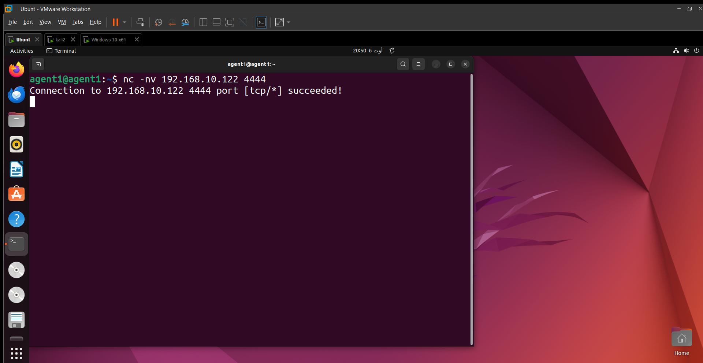

# Analyse et Sécurisation du Réseau a l'aide de Wireshark

## Introduction

Dans un monde où la cybercriminalité et les menaces informatiques évoluent constamment, assurer la sécurité d'un réseau informatique est devenu une priorité cruciale pour les organisations de toutes tailles. Les réseaux modernes, souvent vastes et complexes, sont des cibles fréquentes pour diverses formes d'attaques, telles que les intrusions non autorisées, les attaques par déni de service (DoS) et les tentatives de vol de données. Dans ce contexte, la capacité à détecter et à répondre rapidement aux activités suspectes devient un impératif stratégique.

Ce projet, intitulé "Analyse et Sécurisation du Réseau à l'aide de Wireshark", vise à répondre à ces défis en utilisant Wireshark, un outil de capture et d'analyse de paquets de réseau de renommée mondiale. Wireshark est reconnu pour sa puissance et sa flexibilité, permettant aux professionnels de la sécurité informatique de surveiller, d'analyser et de diagnostiquer les problèmes de réseau de manière détaillée. 

## Préparation de l'Environnement

#### Wireshark

Wireshark est un outil de capture et d'analyse de paquets réseau largement utilisé dans les tests de sécurité et l'analyse de réseaux. Pour ce projet, Wireshark est installé par défaut sur les distributions Kali Linux, qui est un système d'exploitation dédié aux tests de sécurité. Kali Linux fournit une suite complète d'outils pour l'analyse et le test de la sécurité réseau, ce qui facilite l'intégration de Wireshark dans l'environnement de test.

#### Préparation du Réseau de Test

Pour assurer une analyse efficace et sécurisée, un environnement de test isolé a été utilisé en employant VMware Workstation. Le réseau de test a été configuré en mode "Host-Only" pour créer un réseau privé virtuel. Cette configuration permet aux machines virtuelles de communiquer uniquement entre elles et avec l'hôte, tout en restant isolées du réseau externe. Les machines virtuelles utilisées dans ce projet sont :

- **Kali Linux** : Fournit les outils nécessaires pour les tests de sécurité et l'analyse réseau.
- **Metasploitable 2** : Une machine virtuelle vulnérable utilisée pour tester les techniques d'exploitation et les outils de sécurité.
- **Windows XP** : Un système d'exploitation plus ancien souvent ciblé dans des scénarios de tests de sécurité pour évaluer les vulnérabilités et les exploits.
- **Ubuntu 22.04** : Un système d'exploitation moderne utilisé pour simuler un environnement de serveur ou de client dans les tests de réseau.

Les étapes de préparation incluent :

1. **Configuration de VMware Workstation :**
   - **Création d'un réseau virtuel "Host-Only" :** VMware a été configuré pour utiliser un réseau "Host-Only", permettant aux machines virtuelles de communiquer entre elles
   

   - **Ajout des machines virtuelles :** Les machines virtuelles Kali Linux, Metasploitable 2, Windows XP et Ubuntu 22.04 ont été créées et configurées sur ce réseau "Host-Only". Chaque machine virtuelle a été configurée avec une adresse IP  attribuée par le serveur DHCP du réseau "Host-Only".

2. **Vérification de la Connectivité :**
   - **Test de la communication entre les machines :** l'outil `ping` a été utiliséss pour vérifier que les machines virtuelles pouvaient communiquer entre elles .
    

## Démarrage de la Capture avec Wireshark

Après avoir préparé l'environnement de test, il est crucial de configurer correctement Wireshark pour capturer les données pertinentes.
Lors du démarrage de wireshark, l'interface réseau correspondant au réseau "Host-Only" a été sélectionnée pour garantir que le trafic capturé provient du réseau de test isolé.

 

## Configurations des Filtres

Lors de la première exécution de Wireshark, une grande quantité de trafic est observée, comprenant principalement des paquets de diffusion (broadcast) et des protocoles de gestion de réseau tels que ARP, CDP, LLDP et STP.
 
Pour se concentrer sur le trafic pertinent et réduire la surcharge d'informations, un filtre a été appliqué :
  !(eth.dst == ff:ff:ff:ff:ff:ff || arp || cdp || lldp || stp )

  
   
   Ce filtre exclut les paquets de diffusion et les protocoles de gestion réseau, permettant ainsi de se focaliser sur le trafic plus significatif pour l'analyse. 

   ### Filtrage par port :


Pour analyser spécifiquement le trafic ICMP, tel que les requêtes et les réponses de ping, les étapes suivantes ont été suivies :

1. **Effectuer le Ping :**
   - Depuis la machine Kali, un terminal a été ouvert.
   - La commande de ping suivante a été exécutée pour envoyer des paquets ICMP Echo Request à la machine Metasploitable :

     ```bash
     ping 192.168.10.123
     ```

2. **Capturer et Analyser le Trafic :**
   - Wireshark a été lancé et l'interface réseau appropriée pour la capture a été sélectionnée.
   - Le filtre `icmp` a été entré dans la barre de filtre de Wireshark pour afficher uniquement les paquets ICMP :

     ```plaintext
     icmp
     ```

  
     

   - La capture a été démarrée. Les paquets ICMP Echo Request envoyés par Kali et les réponses ICMP Echo Reply de Metasploitable ont été visibles.

**Note :** Après l'application de ce filtre, l'interface de capture peut apparaître vide. Cela est dû à l'exclusion de nombreux types de paquets. Cela peut indiquer que les seuls paquets capturés sont ceux qui ne sont pas filtrés, facilitant ainsi l'analyse des paquets réellement intéressants et réduisant le bruit de fond dans les données capturées.

### Filtrage par Adresses IP : 

Pour se concentrer sur des adresses IP spécifiques dans le réseau, un filtre plus ciblé a été utilisé. Ce filtre permet de restreindre la capture aux paquets envoyés d'une adresse IP source à une adresse IP de destination particulière. Par exemple, pour observer le trafic entre l'adresse IP 192.168.10.219 et l'adresse IP 192.168.10.123, le filtre suivant a été appliqué :

 ```bash
     ip.src == 192.168.10.219 && ip.dst == 192.168.10.123
 ```

  

Ce filtre a permis de se concentrer uniquement sur le trafic entre ces deux adresses IP, facilitant ainsi l'analyse des communications spécifiques entre ces machines et éliminant les autres paquets qui ne sont pas pertinents pour cette analyse.

Pour vérifier la connectivité réseau entre les machines, un test de ping a été effectué depuis la machine Ubuntu, avec l'adresse IP 192.168.10.128, vers la machine Windows, avec l'adresse IP 192.168.10.122. 

 
 

 
**Observation :** Wireshark n'a pas capturé les paquets de ce ping. Cela est dû à l'utilisation du filtre qui spécifiait uniquement les paquets entre deux adresses IP spécifiques. En effet, le filtre appliqué limitait la capture aux paquets entre les adresses IP 192.168.10.219 et 192.168.10.123. Par conséquent, les pings effectués entre les adresses IP 192.168.10.128 et 192.168.10.122 ont été exclus de la capture. 

## SYN Scan et Scan de Handshake Complet

Avant d'appliquer le filtre `tcp.flags.syn==1`, il est important de comprendre les différentes méthodes de scan utilisées pour détecter les ports ouverts sur un réseau. Deux méthodes couramment employées sont le **SYN Scan** et le **scan de handshake complet**.

### SYN Scan

Le **SYN Scan** est une technique de scan de ports qui permet d'identifier les ports ouverts sur une machine cible sans établir une connexion TCP complète. Voici un aperçu de cette méthode :

 **Fonctionnement :**
   - Lors d'un SYN Scan, l'outil de scan envoie des paquets TCP avec le drapeau SYN activé à différents ports sur la machine cible.
   - Si un port est ouvert, le serveur répondra avec un paquet SYN-ACK, indiquant qu'il est prêt à établir une connexion.
   - Si le port est fermé, le serveur répondra avec un paquet RST, signalant que la connexion est refusée.
   - Les ports filtrés peuvent ne pas répondre ou répondre avec un paquet ICMP d'erreur.

 

 
- Le SYN Scan est souvent moins détectable car il ne complète pas la connexion TCP. Cela le rend moins visible pour les systèmes de détection d'intrusion.
-Il est généralement plus rapide que les scans complets puisqu'il n'implique pas la finalisation du processus de connexion.

### Scan de Handshake Complet

En revanche, le **scan de handshake complet** (ou **scan TCP connect()**) établit une connexion TCP complète avec la machine cible. Voici comment il fonctionne :

 
   - Le scan débute par l'envoi d'un paquet SYN. Si le port est ouvert, le serveur répondra avec un SYN-ACK, et l'outil de scan enverra un paquet ACK pour compléter le handshake TCP. La connexion est ensuite fermée avec un paquet FIN.
   - Si le port est fermé, le serveur enverra un paquet RST en réponse.
.
    


   - **Détection :** Le scan de handshake complet établir une connexion complète est plus facile à détecter, ce qui peut rendre le scan plus visible aux systèmes de sécurité.


